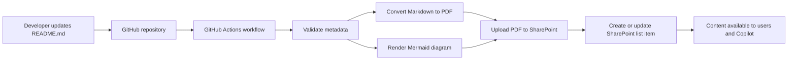

# GitHub to SharePoint Publishing Test

This README is a sample document for testing an automated publishing process from GitHub to SharePoint Online.

## Test Objectives

This document can be used to verify that the publishing workflow can:

1. Detect a new or updated Markdown file in GitHub.
2. Read metadata from the document.
3. Convert Markdown into PDF.
4. Convert Mermaid diagrams into SVG or PNG.
5. Upload generated files to SharePoint.
6. Create or update the related SharePoint list item.

## Sample Architecture

## Sample Metadata Mapping

| GitHub Metadata | SharePoint Column | Sample Value |
|---|---|---|
| `title` | Title | GitHub to SharePoint Publishing Test |
| `document_id` | Document ID | TEST-README-001 |
| `category` | Category | Architecture |
| `owner` | Owner | Asha Mir |
| `status` | Status | Draft |
| `version` | Version | 1.0 |
| `tags` | Tags | GitHub, SharePoint, Power Automate, Mermaid |

## Validation Checklist

- [ ] Markdown file was detected.
- [ ] Front matter was parsed successfully.
- [ ] PDF was generated.
- [ ] Mermaid diagram was rendered.
- [ ] PDF was uploaded to SharePoint.
- [ ] Diagram image was uploaded to SharePoint.
- [ ] SharePoint metadata was populated.
- [ ] Re-running the workflow updated the existing document instead of creating a duplicate.

## Sample Update Test

Change the text below and commit the file again to confirm that the existing SharePoint document is updated.

> Last test result: Not tested yet.

## Notes

This file contains sample content only and should be published to a non-production SharePoint location during testing.
